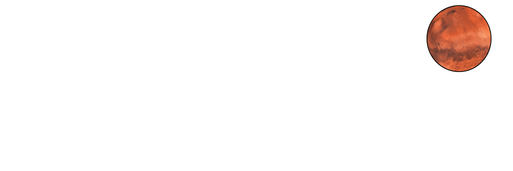

  

# About Muskoin

The only person who can mint a Muskoin is <a href="https://media.giphy.com/media/3jcgPn9fzfaXc1EHJC/giphy.gif">Elon Musk</a>. A Muskoin is an <a href="https://ethereum.org">Ethereum</a>-based ERC-721 <a href="https://en.wikipedia.org/wiki/Non-fungible_token">non-fungible token (NFT)</a> containing a meme signed by Elon Musk.

If you send Elon a meme and he likes it, he might mint you a Muskoin.

We have already built the technical infrastructure to make this a reality. Help us get Elon on board by amplifying our <a href="https://www.twitter.com/MuskoinApp">Twitter</a>!

# How to earn Muskoin 

<video width="100%" controls="controls">
  <source src="./media/meme_instructions.mp4" type="video/mp4">
</video>

## Step 0

Make a meme for Elon and post it somewhere, like <a href="https://www.twitter.com">Twitter</a> or <a href="https://imgur.com/">Imgur</a>.

## Step 1

Visit <a href="http://muskoin.app/#/meme">muskoin.app/#/meme</a>.

## Step 2

Input your meme URL and your Ethereum wallet address, then copy the link the dApp generates for you. 

## Step 3

Send your meme to Elon (e.g. on Twitter) and be sure to include the link from step 2. If its really good, maybe he'll click it. 

# How Elon mints coins

<video width="100%" controls="controls">
  <source src="./media/mint_instructions.mp4" type="video/mp4">
</video>

## Step 0 (only happens once) 

We need Elon to DM or tweet his public Ethereum address (just a Metamask wallet address) to <a href="https://www.twitter.com/MuskoinApp">@MuskoinApp</a> and we will then grant him the MINTER_ROLE in the Mainnet Muskoin ERC721 contract. 

## Step 1

He then clicks the convenience link provided by a meme-maker in their tweet. It will auto-fill the fields on this page: <a href="http://muskoin.app/#/mint">muskoin.app/#/mint</a>. If on a smartphone, use the browser built into the <a href="https://metamask.io">Metamask</a> app. 

## Step 2

With Metamask connected to the dApp, click the button that says "To the Moon!". If Metamask is not connected, this button will help him connect it.

# Leaderboard

Visit <a href="http://muskoin.app/#/memelords">muskoin.app/#/memelords</a> to see who owns Muskoins!

When Elon mints a coin, you will be able to see it in this table.

# Contributing

We built this project for fun and love of sweet memes. We welcome proposed improvements to the source code. If you'd like to contribute, 
you can open a PR to our Github repository.
